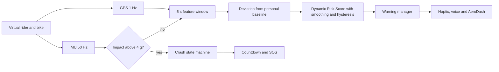
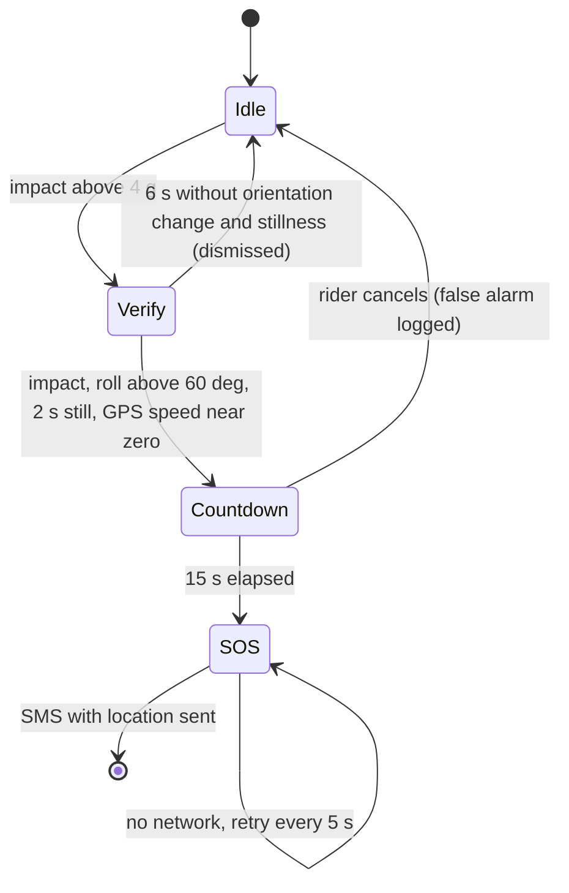

<div align="center">

# AeroGuard AI Simulator

**Edge-intelligent preventive motorcycle safety, simulated end to end in your browser.**
Virtual rider, helmet sensors, on-device risk engine, multi-modal warnings and a verified post-crash SOS workflow.

[](https://github.com/<your-username>/aeroguard-sim/actions)


[**Open live demo**](https://<your-username>.github.io/aeroguard-sim/) | [Screenshots](#screenshots) | [How it works](#how-it-works) | [Run tests](#testing)


</div>

---

## Contents

[Why this exists](#why-this-exists) | [Highlights](#highlights) | [Screenshots](#screenshots) | [Quick start](#quick-start) | [How it works](#how-it-works) | [Scenarios and results](#scenarios-and-measured-results) | [UI guide](#ui-guide) | [Tuning](#tunable-parameters) | [Hardware mapping](#mapping-to-the-real-hardware) | [Testing](#testing) | [Project structure](#project-structure) | [Limitations](#honest-limitations) | [Roadmap](#roadmap) | [FAQ](#faq)

## Why this exists

Helmets protect after impact. Nothing watches the riding itself. AeroGuard AI asks a different question: can a helmet notice that a rider is drifting into a dangerous pattern (repeated harsh braking, growing weave, fatigue-like instability) early enough to warn them, and still call for help if a crash happens?

This repository is the simulation of that idea. It lets you test the logic, thresholds and failure modes before any hardware is built.

## Highlights

| Area | What you get |
|---|---|
| Rider model | Speed controller, random throttle and brake events, yaw-rate weaving, lean angle from `atan(v * yaw_rate / g)` |
| Sensor model | 50 Hz IMU (ax, ay, gyro z, roll) with adjustable Gaussian noise, 1 Hz GPS with noise and on/off switch |
| Personal baseline | First 30 s learn this rider's normal braking, steering and lean statistics |
| Dynamic Risk Score | 0 to 100 score, asymmetric smoothing, hysteresis, per-level cooldown |
| Multi-modal warnings | Haptic pulse, voice prompt, alarm tones (Web Audio and speech synthesis) plus AeroDash LEDs and display |
| Closed loop | Optional rider-response model: after a warning the rider corrects, and the score falls |
| Crash response | Impact, orientation, stillness and GPS fusion, 15 s cancel window, SOS message with coordinates, retry when offline |
| False-alarm handling | Helmet-drop scenario: 12 g spike is dismissed, no SOS |
| Degraded modes | GPS loss, high sensor noise, no phone network |
| Live analytics | Speed, acceleration and risk strips with warning markers, route map, alert counts, time in risk states |
| Quality | 9 automated engine tests, CI workflow, deterministic seed, reproducible screenshots |

## Screenshots

<table>
<tr>
<td width="50%"><br><b>Calm commute.</b> Baseline learned, risk stays in the green band, zero alerts.</td>
<td width="50%"><br><b>Aggressive riding, warnings ignored.</b> Score climbs to critical, voice alarm repeats, AeroDash turns red.</td>
</tr>
<tr>
<td><br><b>Closed loop.</b> With "Rider obeys warnings" on, behaviour is damped after the alert and the score falls.</td>
<td><br><b>Fatigue drift.</b> Steering instability grows slowly; the engine escalates from haptic to voice.</td>
</tr>
<tr>
<td><br><b>Helmet drop.</b> A 12 g spike with no orientation change or stillness is dismissed. No SOS.</td>
<td><br><b>Crash verified.</b> 15 s countdown with the "I am OK" cancel button.</td>
</tr>
<tr>
<td colspan="2"><br><b>No response.</b> SOS message with coordinates and a map link is sent to emergency contacts.</td>
</tr>
</table>

## Quick start

**Option 1. Open the file.** Double-click `index.html`. No build step, no dependencies. Click a scenario once so the browser allows sound.

**Option 2. Local server.**
```bash
python3 -m http.server 8000
# open http://localhost:8000
```

**Option 3. Publish with GitHub Pages.**
```bash
git init && git add . && git commit -m "AeroGuard AI simulator"
git branch -M main
git remote add origin https://github.com/<your-username>/aeroguard-sim.git
git push -u origin main
```
Then: Settings, Pages, Source "Deploy from a branch", branch `main`, folder `/ (root)`. Replace `<your-username>` in this README with your GitHub username.

## How it works

### Data flow



Samples above 4 g go to the crash state machine and are kept out of the risk engine, so one impact spike cannot fake a "risky riding" score.

### Risk engine

Every second, five features are computed over the last 5 s: acceleration std, peak braking, yaw-rate std, roll std and mean lateral acceleration. During the first 30 s the engine stores them as the rider's baseline (mean `mu`, std `sigma`).

```
z_i      = (f_i - mu_i) / max(sigma_i, 0.5 * mu_i + 0.01)
A        = sqrt( mean( max(0, z_i)^2 ) )
anomaly  = 100 / (1 + exp(-(A - 3.5)))
speed    = clamp((km/h - 60) / 40) * 100
lean     = clamp((max|roll| - 25) / 25) * clamp(km/h / 70) * 100
raw      = min(100, 0.7 * anomaly + 0.2 * speed + 0.1 * lean)
DRS      = DRS + alpha * (raw - DRS)        alpha = 0.5 rising, 0.15 falling
```

The score is relative to the rider, not a fixed rulebook, and speed alone never decides the result.

### Risk states and warnings

| DRS | State | Enter / exit | Response |
|---|---|---|---|
| 0 to 30 | Normal | | Silent tracking, green LED |
| 30 to 60 | Elevated | enter 30, exit 25 | Haptic pulse, yellow LED |
| 60 to 85 | High risk | enter 60, exit 55 | Voice "Reduce speed", red LED |
| 85 to 100 | Critical | enter 85, exit 80 | Alarm and voice "Warning. Unstable riding detected.", blinking red LED, repeats every 10 s |

Each level has a 10 s cooldown so a rider is never spammed.

### Crash detection



A single sensor never declares a crash. If GPS is unavailable the speed check is skipped and the other three signals must still agree. After a cancel or dismissal the detector is locked for 10 s.

## Scenarios and measured results

Deterministic seed 7, 150 s simulated ride, default noise. Reproduce with `node tests/engine.test.js` or the browser.

| Scenario | What the rider does | Warnings ignored (max DRS, alerts L1/L2/L3) | Rider obeys warnings |
|---|---|---|---|
| Calm commute | Smooth speed, gentle braking | 4, 0/0/0 | 4, 0/0/0 |
| Aggressive riding | 80+ km/h, hard braking, 0.35 rad/s weave | 93, 1/1/11 | 84, 1/5/0 |
| Fatigue drift | Weave and braking inconsistency grow over time | 72, 1/1/0 | 71, 1/3/0 |
| Helmet drop | 12 g spike, no fall | 4, no alerts, 1 impact dismissed | same |
| Crash | Impact, roll to 88 degrees, no movement | SOS sent | SOS sent |

Numbers are from a synthetic model and show the logic working, not real-world accuracy.

## UI guide

| Control | Effect |
|---|---|
| Scenario buttons | Restart with the chosen ride |
| Pause / Restart | Freeze or reset the current ride |
| Speed 1x to 10x | Simulation speed (use 1x to read the crash countdown) |
| Sensor noise | Scales Gaussian noise on every IMU channel |
| Rider obeys warnings | Enables the closed-loop behaviour model |
| GPS available | Off: speed term disabled after 5 s, crash check skips GPS |
| Phone network | Off: SOS is queued and retried every 5 s |
| Sound | Alert tones and spoken prompts |
| I am OK, cancel alert | Cancels a crash countdown |

## Tunable parameters

All constants live in the clearly marked `ENGINE_START` block of `index.html`.

| Parameter | Value | Where |
|---|---|---|
| IMU rate / GPS rate | 50 Hz / 1 Hz | `step`, `tick` |
| Calibration length | 30 s | `mk` (`cal`) |
| Feature window | 250 samples (5 s) | `step` |
| State thresholds | 30, 60, 85 (exit minus 5) | `T`, `tick` |
| Alert cooldown | 10 s | `fire` |
| Impact / roll / stillness | 4 g, 60 degrees, 2 s | `crash` |
| Countdown / retry | 15 s / 5 s | `crash` |
| Rider response | 2.5 s delay, 25 s at 35 percent intensity | `fire`, `prof` |

## Mapping to the real hardware

| Simulator function | Real component |
|---|---|
| `imu()` | MPU6050 over I2C at 50 Hz |
| GPS in `tick()` | NEO-6M over UART at 1 Hz |
| `tick()` risk engine | 1 Hz task on ESP32 (four 250-sample buffers fit in about 4 KB) |
| `fire()` | Vibration motor on GPIO, Bluetooth audio for voice, BLE to AeroDash |
| `crash()` | ESP32 state machine; SOS SMS sent by the phone app |

## Testing

```bash
node tests/engine.test.js
```

Nine tests run the same engine code used by the page: calm ride raises no alerts, aggressive riding reaches critical when ignored, an obeying rider avoids critical, fatigue escalates gradually, helmet drop is dismissed, crash triggers SOS, cancel works, offline crash queues then sends, GPS loss still warns. CI runs them on every push.

Regenerate screenshots:
```bash
pip install playwright && playwright install chromium
python3 scripts/capture_screenshots.py
```

## Project structure

```
aeroguard-sim/
├── index.html                     simulator (engine, UI, audio) in one file
├── tests/engine.test.js           headless engine tests, no dependencies
├── scripts/capture_screenshots.py Playwright screenshot generator
├── docs/screenshots/              images used in this README
├── .github/workflows/test.yml     CI
├── README.md
└── LICENSE
```

## Honest limitations

- The baseline model is a statistical deviation scorer, not a trained neural network. It demonstrates the pipeline and thresholds; it does not prove real-world accuracy.
- Rider, road and crash dynamics are simplified synthetic models. The 4 g, 60 degree and 2 s thresholds must be validated on real ride and crash-test data.
- Demo SOS coordinates start from a generic origin and no real message is sent.
- This is risk detection, not accident prediction. It is a student prototype and not a certified safety device.

## Roadmap

- [x] Rider, sensor and crash models with noise
- [x] Personal baseline, risk score, hysteresis, cooldown
- [x] Haptic, voice and AeroDash warnings with sound
- [x] Verified crash workflow, offline retry, false-alarm scenario
- [x] Automated tests, CI, reproducible screenshots
- [ ] Python port with scikit-learn Isolation Forest and 1D-CNN autoencoder
- [ ] Precision, recall and false alerts per hour on labelled rides
- [ ] TFLite Micro export for ESP32
- [ ] Hardware-in-the-loop with MPU6050 and NEO-6M
- [ ] Rider fatigue indicators beyond steering variance

## FAQ

<details><summary>Can the simulator predict an accident?</summary>
No. It detects elevated-risk riding patterns and warns early. Predicting a specific accident is not claimed.
</details>

<details><summary>Why is the baseline learned in the first 30 s?</summary>
So the score is relative to each rider and bike. 30 s keeps the demo fast; a real device would calibrate over many rides.
</details>

<details><summary>Why can a helmet drop not trigger an SOS?</summary>
SOS needs impact, a large roll angle and sustained stillness together, plus GPS speed near zero when GPS is available.
</details>

<details><summary>Does it send real messages?</summary>
No. The SOS panel shows the message the phone app would send.
</details>

## License

MIT. See [LICENSE](LICENSE).
